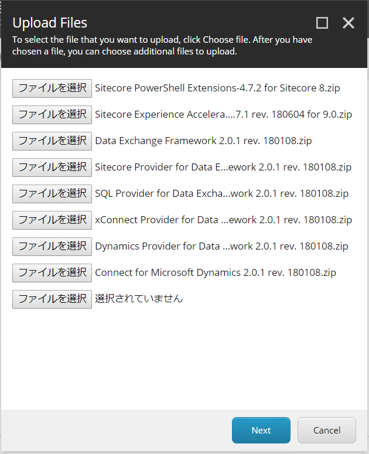
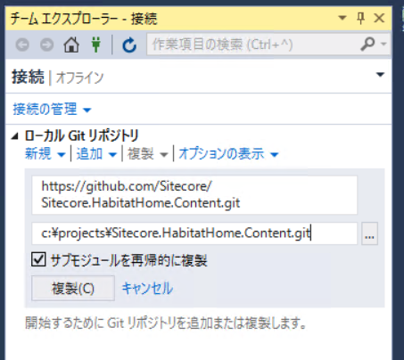

# Sitecore HabitatHome Commerce のインストール

ここで紹介をしている Sitecore HabitatHome Commerce は以下の GitHub のリポジトリで公開されているものを紹介しています。

* [https://github.com/Sitecore/Sitecore.HabitatHome.Platform](https://github.com/Sitecore/Sitecore.HabitatHome.Platform)
* [https://github.com/Sitecore/Sitecore.HabitatHome.Commerce](https://github.com/Sitecore/Sitecore.HabitatHome.Commerce)


## インストール環境の確認

Sitecore Experience Platform 9.0 update 2を利用しています。

デモ環境は、Sitecore のインストール環境としては、以下の設定が標準で設定されています。

この製品の <a href="https://sitecorejapan.github.io/InstallScript/90/Sitecore-Experience-Platform-902.html" target="_blank">インストール手順</a> を確認してください。インストール先の情報としては、以下がデフォルトとなっています。この設定を利用しているスクリプトは [HabitatHomeXC90.md](https://github.com/SitecoreJapan/InstallScript/tree/master/habitat) からダウンロードできます。

**プロジェクトの場所**		`c:\projects\Sitecore.HabitatHome.Platform\`
**Habitat サイトドメイン**				`habitathome.dev.local`
**Web Root**						`c:\inetpub\wwwroot`
**Host Suffix**						`dev.local`
**xConnectRoot** 	`habitathome_xconnect.dev.local`

* **インストールディレクトリ**: C:\inetpub\wwwroot\habitathome.dev.local
* **ドメイン名**: https://habitathome.dev.local/
* **xConnect ルート**: C:\inetpub\wwwroot\habitathome_xconnect.dev.local\
* **xConnect ホスト**: habitathome_xconnect.dev.local

```
$prefix = "dev.local"
$XConnectCollectionService = "habitathome_xconnect.dev.local"
$sitecoreSiteName = "habitathome.dev.local"

$xconnectHostName = "habitathome_xconnect.dev.local"
```

Sitecore のクリーンインストールが完了すると、 http://habitathome.dev.local/ でアクセスができるようになり、また /sitecore と入力するとログイン画面が表示されます。

# モジュールのインストール

デモサイトで必要なモジュールをインストールしていきます。モジュールは以下の順番でインストールを進めてください。

* Sitecore PowerShell Extensions-4.7.2 for Sitecore 8.zip 
* Sitecore Experience Accelerator 1.7.1 rev. 180604 for 9.0.zip
* Data Exchange Framework 2.0.1 rev. 180108.zip 
* Sitecore Provider for Data Exchange Framework 2.0.1 rev. 180108.zip
* SQL Provider for Data Exchange Framework 2.0.1 rev. 180108.zip
* xConnect Provider for Data Exchange Framework 2.0.1 rev. 180108.zip
* Dynamics Provider for Data Exchange Framework 2.0.1 rev. 180108.zip
* Connect for Microsoft Dynamics 2.0.1 rev. 180108.zip



/App_Config/connectionstrings.config に Dynamics につなげるための Connection Strings を追加してください。

```
  <add name="democrm" connectionString="url=https://sitecore1.crm4.dynamics.com/XRMServices/2011/Organization.svc;user id=crmdemo@demo1.onmicrosoft.com;password=password;organization=org;authentication type=2"/>
```

id
password
organization

Dynamics 365 のパラメーターを利用してください。


展開をするにあたって https で habitathome.dev.local を利用するにあたって自己証明書を作成する必要があります。

habitatdevhome.cert.ps1

を c:\projects\sif にコピーして実行することで証明書が作成されますので、IIS の設定で証明書をバインドしてください。


# リポジトリのクローン

* Git for Windows

Sitecore の環境が整ったところで、GitHub で提供されているサンプルを適用していきます。ここでは、Visual Studio 2017 の環境実行しています。

1. チームエクスプローラを開き、GitHub のリポジトリの URL を利用してクローンを作成します。作成先は c:\projects\sitecore.habitathome.plathome です。



2. インストールに関する設定変更

以下の内容がデフォルトの設定となっています。

**Project location**		`c:\projects\sitecore.habitathome.content\`
**Habitat Site domain**				`habitathome.dev.local`
**Web Root**						`c:\inetpub\wwwroot`
**Host Suffix**						`dev.local`
**xConnectRoot** 	`habitat_xconnect.dev.local`

Commerce を展開するため、build.ps1 のコマンドで Quick-Deploy をつけて実行します。

.\build.ps1 -Target "Quick-Deploy"

```
PS C:\projects\Sitecore.HabitatHome.Platform> .\build.ps1 -Target "Quick-Deploy"
Preparing to run build script...
Running build script...
The assembly 'Cake.Http, Version=0.5.0.0, Culture=neutral, PublicKeyToken=null'
is referencing an older version of Cake.Core (0.26.1).
For best compatibility it should target Cake.Core version 0.28.0.
The assembly 'Cake.Json, Version=3.0.1.0, Culture=neutral, PublicKeyToken=null'
is referencing an older version of Cake.Core (0.26.0).
For best compatibility it should target Cake.Core version 0.28.0.
(2705,12): warning CS1701: Assuming assembly reference 'Newtonsoft.Json, Version=9.0.0.0, Culture=neutral, PublicKeyToke
n=30ad4fe6b2a6aeed' used by 'Cake.Json' matches identity 'Newtonsoft.Json, Version=12.0.0.0, Culture=neutral, PublicKeyT
oken=30ad4fe6b2a6aeed' of 'Newtonsoft.Json', you may need to supply runtime policy
(2711,12): warning CS1701: Assuming assembly reference 'Newtonsoft.Json, Version=9.0.0.0, Culture=neutral, PublicKeyToke
n=30ad4fe6b2a6aeed' used by 'Cake.Json' matches identity 'Newtonsoft.Json, Version=12.0.0.0, Culture=neutral, PublicKeyT
oken=30ad4fe6b2a6aeed' of 'Newtonsoft.Json', you may need to supply runtime policy

----------------------------------------
Setup
----------------------------------------


   ) )       /\
  =====     /  \
 _|___|____/ __ \____________
|:::::::::/ ==== \:::::::::::|
|:::::::::/ ====  \::::::::::|
|::::::::/__________\:::::::::|
|_________|  ____  |_________|
| ______  | / || \ | _______ |            _   _       _     _ _        _     _   _
||  |   | | ====== ||   |   ||           | | | |     | |   (_) |      | |   | | | |
||--+---| | |    | ||---+---||           | |_| | __ _| |__  _| |_ __ _| |_  | |_| | ___  _ __ ___   ___
||__|___| | |   o| ||___|___||           |  _  |/ _` | '_ \| | __/ _` | __| |  _  |/ _ \| '_ ` _ \ / _ \
|======== | |____| |=========|           | | | | (_| | |_) | | || (_| | |_  | | | | (_) | | | | | |  __/
(^^-^^^^^- |______|-^^^--^^^)            \_| |_/\__,_|_.__/|_|\__\__,_|\__| \_| |_/\___/|_| |_| |_|\___|
(,, , ,, , |______|,,,, ,, ,)
','',,,,'  |______|,,,',',;;


 --------------------  ------------------
   The Habitat Home source code, tools and processes are examples of Sitecore Features.
   Habitat Home is not supported by Sitecore and should be used at your own risk.

中略


========================================
Quick-Deploy
========================================

Task                          Duration
--------------------------------------------------
Setup                         00:00:00.1395423
Clean                         00:00:01.4029839
Modify-PublishSettings        00:00:00.0280371
Build-Solution                00:02:40.2691083
Publish-Foundation-Projects   00:00:17.5088956
Publish-Feature-Projects      00:00:13.0039602
Publish-Project-Projects      00:00:05.7886071
Apply-Xml-Transform           00:00:00.9522365
Modify-Unicorn-Source-Folder  00:00:00.0059750
Publish-Transforms            00:00:00.7723915
Publish-xConnect-Project      00:00:00.7384235
--------------------------------------------------
Total:                        00:03:20.6200163
PS C:\projects\Sitecore.HabitatHome.Platform>

```

---
[目次に戻る](./readme.md)