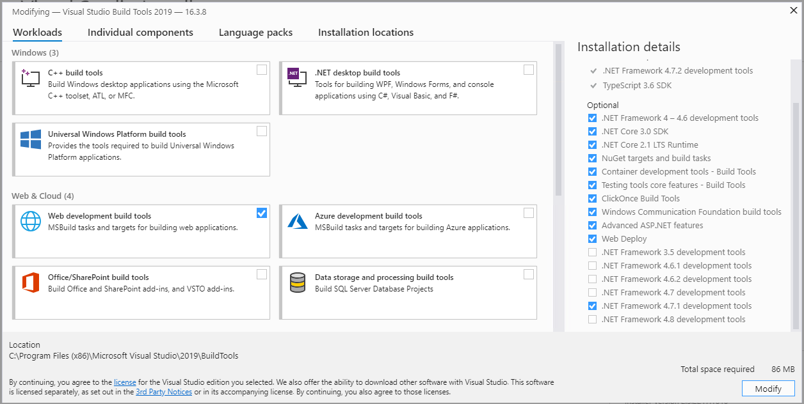

# Sitecore HabitatHome Platform のインストール

ここで紹介をしている Sitecore HabitatHome Plathome は以下の GitHub のリポジトリで公開されているものを紹介しています。

* [https://github.com/Sitecore/Sitecore.HabitatHome.Platform](https://github.com/Sitecore/Sitecore.HabitatHome.Platform)

## インストール環境の確認

Sitecore Experience Platform 9.2 Initial Release を利用しています。

デモ環境は、Sitecore のインストール環境としては、以下の設定が標準で設定されています。

この製品の <a href="https://sitecoreinstall.cmsdemo.jp/92/Sitecore-Experience-Platform-920.html" target="_blank">インストール手順</a> を確認してください。インストール先の情報としては、以下がデフォルトとなっています。この設定を利用しているスクリプトは [ここ](https://github.com/SitecoreJapan/InstallScript/tree/master/habitat) の Habitat-920-XP0.ps1 を利用してください。

**プロジェクトの場所**		`c:\projects\Sitecore.HabitatHome.Platform\`
**Habitat サイトドメイン**				`habitathome.dev.local`
**Web Root**						`c:\inetpub\wwwroot`
**Host Suffix**						`dev.local`
**xConnectRoot** 	`habitathome_xconnect.dev.local`

* **インストールディレクトリ**: C:\inetpub\wwwroot\habitathome.dev.local
* **ドメイン名**: https://habitathome.dev.local/
* **xConnect ルート**: C:\inetpub\wwwroot\habitathome_xconnect.dev.local\
* **xConnect ホスト**: habitathome_xconnect.dev.local


```
$prefix = "dev.local"
$XConnectCollectionService = "habitathome_xconnect.dev.local"
$sitecoreSiteName = "habitathome.dev.local"

$xconnectHostName = "habitathome_xconnect.dev.local"
```

Sitecore のクリーンインストールが完了すると、 http://habitathome.dev.local/ でアクセスができるようになり、また /sitecore と入力するとログイン画面が表示されます。

# モジュールのインストール

デモサイトで必要なモジュールをインストールしていきます。モジュールは以下の順番でインストールを進めてください。

* Sitecore PowerShell Extensions-5.0 for 9.2.zip 
* Sitecore Experience Accelerator 1.9.0 rev. 190528 for 9.2.zip

Data Exchange Framework は任意でインストールすることができます。

* [Sitecore Connect for Salesforce CRM 3.0.0](https://sitecorequickstart.cmsdemo.jp/modules/connectsfcrm.html)
* [https://sitecorequickstart.cmsdemo.jp/modules/connectdcrm.html](https://sitecorequickstart.cmsdemo.jp/modules/connectdcrm.html)

# 日本語リソースの追加

Sitecore Experience Platform 9.2 Initial Release の日本語リソースの追加および SXA の日本語リソースを追加してください。追加の手順は、[Youtube の動画](https://www.youtube.com/watch?v=iJGBN0wj10s) が参考になります。

# 証明書の追加

[ここ](https://github.com/SitecoreJapan/InstallScript/tree/master/habitat) にある habitatdevhome.cert.ps1 のファイルを c:\projects\sif のフォルダにコピーをして実行してください。自己証明書が生成されたあと、 IIS にて https://habitathome.dev.local/ でアクセスできることを確認します。

https での接続でもログインができるようにするために、 Identity Server の設定を変更する必要があります。

C:\inetpub\wwwroot\habitathome.identityserver\Config\production にある Sitecore.IdentityServer.Host.xml のファイルを開いて、対象となる URL に関して http から https に変更してください。

# リポジトリのクローン

https://github.com/Sitecore/Sitecore.HabitatHome.Platform のリポジトリのクローンを作成してください。Build を実行するにあたっては、以下の2つのファイルが設定ファイルになっています。

* cake-config.json
* publishsettings.targets

Sitecore Experience Platform のインストール環境に合わせて、パラメーターを変更してください。

# 必要なツールのインストール

以下のツールをインストールしてください。

* [Node.js](https://nodejs.org/ja/) 推奨版をインストールします
* [Build Tools for Visual Studio 2019](https://visualstudio.microsoft.com/ja/downloads/) リンク先のページで、Tools for Visual Studio 2019 の中に含まれています。
    * Web development build tools をチェック、合わせて .NET Framework 4.7.1 をチェックしてください。



# ソリューションを構築する

上記の準備が完了したあと、準備されている build.ps1 を実行してください。

```
PS C:\projects\Sitecore.HabitatHome.Platform> .\build.ps1
Preparing to run build script...
Running build script...
The assembly 'Cake.Azure, Version=0.3.0.0, Culture=neutral, PublicKeyToken=null'
is referencing an older version of Cake.Core (0.28.0).
For best compatibility it should target Cake.Core version 0.33.0.
The assembly 'Cake.XdtTransform, Version=0.16.0.0, Culture=neutral, PublicKeyToken=null'
is referencing an older version of Cake.Core (0.28.1).
For best compatibility it should target Cake.Core version 0.33.0.

----------------------------------------
Setup
----------------------------------------


   ) )       /\
  =====     /  \
 _|___|____/ __ \____________
|:::::::::/ ==== \:::::::::::|
|:::::::::/ ====  \::::::::::|
|::::::::/__________\:::::::::|
|_________|  ____  |_________|
| ______  | / || \ | _______ |            _   _       _     _ _        _     _   _
||  |   | | ====== ||   |   ||           | | | |     | |   (_) |      | |   | | | |
||--+---| | |    | ||---+---||           | |_| | __ _| |__  _| |_ __ _| |_  | |_| | ___  _ __ ___   ___
||__|___| | |   o| ||___|___||           |  _  |/ _` | '_ \| | __/ _` | __| |  _  |/ _ \| '_ ` _ \ / _ \
|======== | |____| |=========|           | | | | (_| | |_) | | || (_| | |_  | | | | (_) | | | | | |  __/
(^^-^^^^^- |______|-^^^--^^^)            \_| |_/\__,_|_.__/|_|\__\__,_|\__| \_| |_/\___/|_| |_| |_|\___|
(,, , ,, , |______|,,,, ,, ,)
','',,,,'  |______|,,,',',;;


 --------------------  ------------------
   The Habitat Home source code, tools and processes are examples of Sitecore Features.
   Habitat Home is not supported by Sitecore and should be used at your own risk.
   
```

# インストール後の作業

インストールが完了したあと、以下の手順を実行してください。

- 全コンテンツの Republish
- インデックスの再構築

---
[目次に戻る](../)